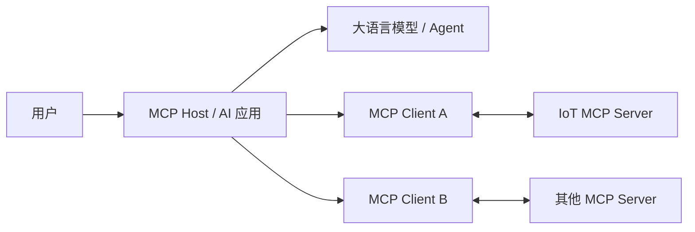
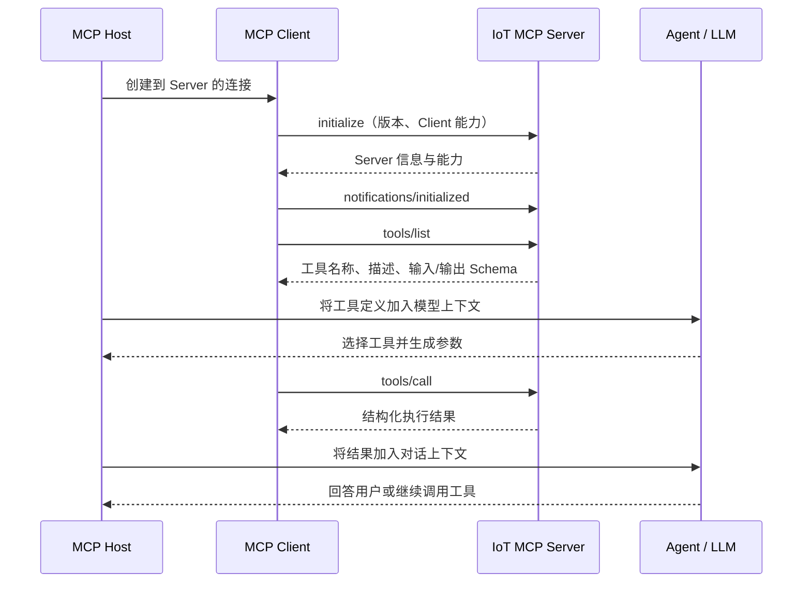
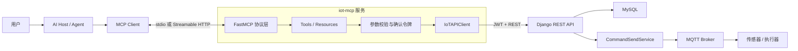
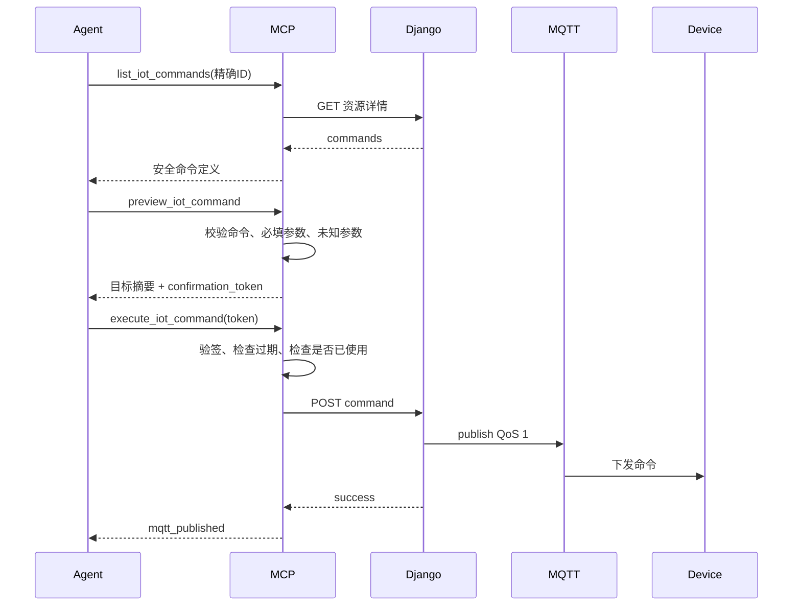

# MCP 与 AI Agent 集成指南：从基础概念到本项目实现

本文面向第一次接触 MCP、Agent 和工具调用的开发者，完整说明以下问题：

- MCP 是什么，解决什么问题；
- Agent、MCP Host、MCP Client、MCP Server 分别是什么；
- AI 为什么知道有哪些工具，以及一次工具调用如何发生；
- 本项目的 MCP Server 如何启动、如何访问 Django、如何控制物联网设备；
- 当前提供了哪些功能、每个功能如何实现；
- 如何配置、运行、测试、调试和扩展新的 MCP 工具；
- 当前实现的安全边界与后续演进方向。

本文对应的源码位于仓库根目录 `mcp/`。简明运行说明见 `mcp/README.md`，本文侧重原理、架构和开发方法。

---

## 1. 先建立整体认识

### 1.1 MCP 是什么

MCP 全称 **Model Context Protocol（模型上下文协议）**。它是一套开放协议，用来让 AI 应用以统一方式连接外部数据和能力，例如：

- 读取数据库中的记录；
- 搜索文件；
- 调用业务 API；
- 控制设备；
- 创建工单；
- 获取一组可复用的提示模板。

可以把 MCP 类比成“AI 世界的通用外设接口”：

- USB 规定电脑如何发现和使用键盘、鼠标、U 盘；
- MCP 规定 AI 应用如何发现和调用外部 Tools、Resources、Prompts。

MCP 解决的是“连接标准化”问题。它不负责训练模型，也不规定 Agent 应该怎样思考。

官方定义可参考：[MCP 简介](https://modelcontextprotocol.io/docs/getting-started/intro)和[架构概览](https://modelcontextprotocol.io/docs/learn/architecture)。

### 1.2 MCP Server 不是 AI

这是理解本项目最重要的一点：

> MCP Server 本身不运行大语言模型，也不负责理解“帮我打开实验室的灯”这句自然语言。

真正的职责分工如下：

1. 用户向 Agent 提出自然语言请求；
2. Agent 所在的 AI 应用把可用工具描述交给模型；
3. 模型判断应该调用哪个工具，并生成结构化参数；
4. AI 应用通过 MCP Client 把调用请求发给 MCP Server；
5. MCP Server 校验参数、调用 Django REST API，并返回结构化结果；
6. AI 应用把结果重新交给模型；
7. 模型组织为用户可以理解的回答，或者继续调用下一个工具。

因此，MCP Server 更像一个“严格、可审计的业务能力适配器”，而不是聊天机器人。

### 1.3 为什么不让 Agent 直接调用 REST API

理论上，Agent 可以直接写 HTTP 请求。但 MCP 带来了几个关键好处：

| 直接调用 REST | 通过 MCP |
|---|---|
| 每种 Agent 都要单独写接口说明 | 支持 MCP 的 Agent 可以自动发现工具 |
| 模型容易拼错 URL、字段或 HTTP 方法 | 参数由 JSON Schema 描述和校验 |
| 很难区分只读、写入、破坏性操作 | Tool Annotations 可提示风险类型 |
| 返回格式容易不一致 | 可以统一返回结构化结果 |
| 接入新 AI 客户端时重复开发 | MCP Server 可以被多个兼容 Host 使用 |

MCP 并不是要替代 REST API。本项目采用的是分层方式：

```text
AI Agent → MCP → Django REST API → 业务服务 → MySQL / MQTT
```

Django REST API 仍然是业务事实来源；MCP 只负责把它包装成适合 Agent 发现和调用的能力。

---

## 2. MCP 架构中的角色

MCP 使用 Host–Client–Server 架构。



### 2.1 MCP Host

Host 是用户真正使用的 AI 应用，例如支持 MCP 的桌面客户端、IDE 或 Agent 框架。它负责：

- 管理对话和模型；
- 读取 MCP Server 配置；
- 为每个 Server 创建 MCP Client；
- 把工具定义提供给模型；
- 根据安全策略批准、拒绝或询问用户是否执行工具；
- 把工具执行结果放回模型上下文。

### 2.2 MCP Client

MCP Client 是 Host 内部的协议组件。通常一个 Client 只维护到一个 MCP Server 的连接。它负责：

- 初始化连接；
- 协商协议版本和能力；
- 调用 `tools/list`、`tools/call`、`resources/read` 等协议方法；
- 编解码 JSON-RPC 消息；
- 管理 transport 和会话生命周期。

日常使用时，用户通常不用手写 MCP Client，Host 已经内置了它。

### 2.3 MCP Server

MCP Server 是能力提供者。本项目的 Server 负责：

- 公布 IoT 工具的名称、说明、参数 Schema 和风险提示；
- 接收并校验工具参数；
- 登录 Django API 并管理 JWT；
- 把工具调用转换成受控 REST 请求；
- 对命令执行和删除操作实施两阶段确认；
- 把 Django 返回值转换成统一结构；
- 向 MCP Client 返回结果。

### 2.4 Agent 或模型

Agent 是使用模型、上下文、工具和循环控制来完成任务的系统。一个简单 Agent 循环可以理解为：

```text
观察当前上下文
  → 决定直接回答还是调用工具
  → 如果调用工具，等待结果
  → 将结果加入上下文
  → 再次判断
  → 直到任务完成
```

模型选择工具并不代表它可以绕过权限。最终是否执行、能执行什么，仍由 Host、MCP Server 和 Django 后端共同决定。

---

## 3. MCP 的协议组成

### 3.1 数据层：JSON-RPC 2.0

MCP 的数据层基于 JSON-RPC 2.0。请求通常包含：

```json
{
  "jsonrpc": "2.0",
  "id": 12,
  "method": "tools/call",
  "params": {
    "name": "get_iot_asset",
    "arguments": {
      "kind": "sensor",
      "asset_id": "temperature_001"
    }
  }
}
```

SDK 会自动完成消息编解码，本项目代码不需要手写这些 JSON-RPC 报文。

### 3.2 Transport：消息通过什么通道传递

MCP 当前主要有两种标准 transport。

#### stdio

stdio 使用进程的标准输入和标准输出：

1. Host 启动 MCP Server 子进程；
2. Host 向 Server 的 `stdin` 写入 JSON-RPC；
3. Server 从 `stdout` 返回 JSON-RPC；
4. 进程退出时连接结束。

优点：

- 无需开放端口；
- 本机使用简单；
- 网络攻击面较小；
- 很适合个人电脑上的 Codex、IDE 或桌面 Agent。

注意：stdio 模式下 `stdout` 只能输出 MCP 消息，调试日志应该写到 `stderr`，否则会破坏协议流。

#### Streamable HTTP

Streamable HTTP 让 MCP Server 作为独立 HTTP 服务运行。Client 连接统一的 MCP endpoint，例如：

```text
http://127.0.0.1:48082/mcp
```

它使用 HTTP POST/GET，并可以配合 SSE 完成流式消息。适合：

- Docker 部署；
- 多个 Client 使用同一个 Server；
- Server 与 Host 不在同一进程；
- 需要接入标准 HTTP 鉴权、代理、监控的场景。

旧式 HTTP+SSE transport 已被 Streamable HTTP 替代。协议细节参见[官方 Transport 规范](https://modelcontextprotocol.io/specification/2025-06-18/basic/transports)。

### 3.3 Server 可以暴露的三类核心能力

| 能力 | 含义 | 典型例子 | 本项目状态 |
|---|---|---|---|
| Tools | 可执行函数，会进行查询或产生动作 | 查询数据、控制继电器、创建资源 | 已实现 |
| Resources | 可以按 URI 读取的上下文数据 | 资源目录、设备详情、文件内容 | 已实现 |
| Prompts | 可复用的提示或工作流模板 | “分析最近 24 小时温度”模板 | 暂未实现 |

#### Tools

Tool 包含：

- `name`：机器使用的唯一名称；
- `title`：人类可读标题；
- `description`：告诉模型何时以及如何使用；
- `inputSchema`：参数 JSON Schema；
- `outputSchema`：结构化返回 Schema；
- `annotations`：只读、破坏性、幂等等风险提示。

#### Resources

Resource 类似“可读取的数据对象”，由 URI 标识，例如：

```text
iot://catalog
iot://assets/device/potential_controller_001
```

Resource 适合给模型补充上下文；Tool 适合执行带参数的动作。不同 Host 对 Resources 的自动使用程度不同，所以关键查询功能仍应提供 Tool。

#### Prompts

Prompt 是可复用的对话模板，不是 System Prompt 的替代物。例如未来可以加入：

```text
analyze_sensor_anomaly(sensor_id, hours)
```

它可以提示模型先查询资源、再比较阈值、最后给出诊断。当前项目尚未实现 Prompt，因为第一阶段优先建立安全的数据与控制能力。

### 3.4 Client 也可以向 Server 提供能力

高级 MCP 场景中，Client 还可以支持：

- Sampling：Server 请求 Host 使用模型生成内容；
- Elicitation：Server 请求用户补充结构化信息；
- Logging：Server 向 Client 发送日志；
- Progress：长任务上报进度。

当前 IoT MCP 没有使用 Sampling，也不会在服务内部二次调用模型。这样架构更简单、成本更可控，也避免 Server 擅自发起模型推理。

---

## 4. 一次 MCP 连接和工具调用如何发生

MCP 连接具有生命周期。基本顺序如下：



初始化阶段会协商协议版本和双方能力。只有初始化完成后，Client 才应该进入正常操作阶段。详见[官方 Lifecycle 规范](https://modelcontextprotocol.io/specification/2025-06-18/basic/lifecycle)。

### 4.1 模型是怎样“知道”工具的

模型并没有扫描 Python 文件。过程是：

1. `FastMCP` 根据 Python 函数签名、类型注解和 docstring 生成 JSON Schema；
2. Client 调用 `tools/list` 获取 Schema；
3. Host 把这些工具描述以模型支持的 tool/function calling 格式放入推理请求；
4. 模型根据用户目标和工具描述选择工具；
5. Host 截获模型生成的工具调用，不把它当普通文本输出；
6. Host 通过 MCP Client 执行调用。

例如下面的函数签名：

```python
async def get_iot_asset(
    kind: Literal["sensor", "device"],
    asset_id: str,
) -> dict[str, Any]:
    ...
```

会让模型知道：

- `kind` 只能是 `sensor` 或 `device`；
- `asset_id` 是必填字符串；
- 返回值是结构化对象。

这就是类型注解对 MCP 很重要的原因。

---

## 5. 本项目 MCP Server 的总体架构



### 5.1 核心设计原则

#### MCP 不直接访问数据库

MCP Server 不 import Django ORM，也不连接生产 MySQL。所有操作通过 REST API 完成。这保证：

- Django serializer 校验继续生效；
- `IsAuthenticated` / `IsAdminUser` 权限继续生效；
- MQTT 命令逻辑只有一份；
- 后续后端字段变化时，不需要在 MCP 中复制数据库知识；
- MCP 无法执行任意 SQL。

#### MCP 不提供任意 MQTT publish

Agent 只能从资源类型定义的命令中选择，例如 `high`、`low`、`set_interval`。MCP 不向 Agent 暴露 `mqtt_message` 模板，也没有 `publish(topic, payload)` 这种万能工具。

#### 查询可以模糊，写操作必须精确

`search_iot_assets` 可以使用名称关键词帮助 Agent 找候选项，但控制、更新和删除必须提交明确的 `sensor_id` 或 `device_id`。

旧实现采用“模糊搜索后取第一项”，可能控制错设备；新架构明确禁止这种行为。

#### 危险操作采用两阶段流程

命令执行和删除都必须：

```text
preview → 用户/Agent确认目标 → execute
```

预览阶段返回短时、不可篡改、单次使用的确认令牌。执行阶段不重新接受目标和命令参数，而是从令牌恢复已经确认的内容，防止预览后偷偷换目标。

---

## 6. 代码目录与职责

```text
mcp/
├── Dockerfile
├── pyproject.toml
├── README.md
├── iot_mcp/
│   ├── __init__.py
│   ├── config.py
│   ├── api_client.py
│   ├── confirmation.py
│   └── server.py
└── tests/
    ├── test_api_client.py
    ├── test_config.py
    ├── test_confirmation.py
    └── test_server_tools.py
```

| 文件 | 职责 |
|---|---|
| `pyproject.toml` | Python 包信息、命令入口、MCP/httpx 依赖版本 |
| `config.py` | 从环境变量读取平台地址、凭据、transport、端口和确认密钥 |
| `api_client.py` | 异步 REST Client、JWT 登录/刷新、超时与错误转换 |
| `confirmation.py` | HMAC 确认令牌生成、验签、过期和单次使用检查 |
| `server.py` | 创建 FastMCP、注册 Tools/Resources、执行业务编排 |
| `Dockerfile` | 构建独立 `iot-mcp` 容器 |
| `tests/` | API、配置、令牌和工具流程测试 |

### 6.1 为什么目录叫 `mcp`，Python 包叫 `iot_mcp`

官方 SDK 本身的 import 名称就是 `mcp`：

```python
from mcp.server.fastmcp import FastMCP
```

如果本项目内部包也叫 `mcp`，可能遮蔽官方 SDK。因此：

- 项目主题目录叫 `mcp/`；
- 真正的 Python 包叫 `iot_mcp/`。

这样既满足目录语义，又避免模块名冲突。

---

## 7. MCP Server 是如何启动的

### 7.1 安装时发生什么

`pyproject.toml` 声明了：

```toml
[project.scripts]
iot-mcp = "iot_mcp.server:main"
```

安装项目后，Python 环境会生成 `iot-mcp` 命令。执行该命令等价于调用：

```python
from iot_mcp.server import main
main()
```

### 7.2 import `server.py` 时发生什么

`server.py` 顶层依次完成：

1. `Settings.from_env()` 读取环境变量；
2. 创建 `IoTAPIClient`；
3. 创建 `ConfirmationStore`；
4. 创建 `FastMCP` 实例；
5. 执行每个 `@mcp.tool(...)` 装饰器，注册工具；
6. 执行每个 `@mcp.resource(...)` 装饰器，注册资源。

注册阶段不会立刻登录 Django，也不会操作设备。只有实际调用工具时，`IoTAPIClient` 才会按需认证。

### 7.3 `main()` 如何选择运行模式

入口代码本质上是：

```python
def main() -> None:
    mcp.run(transport=settings.transport)
```

- `IOT_MCP_TRANSPORT=stdio`：阻塞读取 stdin，向 stdout 写 MCP 消息；
- `IOT_MCP_TRANSPORT=streamable-http`：启动 Uvicorn/ASGI HTTP 服务；
- HTTP endpoint 固定为 `/mcp`；
- Docker 内监听 `0.0.0.0:8000`；
- 宿主机只映射到 `127.0.0.1:48082`。

### 7.4 为什么固定 MCP SDK `<2`

当前项目依赖：

```toml
"mcp>=1.27,<2"
```

编写本文时官方 Python SDK 的 v1 仍是稳定系列，v2 处于预发布演进阶段。增加 `<2` 可以避免镜像重建时自动升级到不兼容的大版本。官方版本状态和迁移信息应以[Python SDK 仓库](https://github.com/modelcontextprotocol/python-sdk)为准。

---

## 8. IoTAPIClient 如何工作

`IoTAPIClient` 是 MCP 与 Django 之间的唯一业务网络出口。

### 8.1 延迟登录

服务启动时不登录。第一次调用 REST 请求时：

1. 检查是否已经有 access token；
2. 如果没有，验证是否配置了凭据；
3. POST `/api/auth/login/`；
4. 保存 access 和 refresh token；
5. 使用 `Authorization: Bearer <access>` 调用业务 API。

这样 MCP Server 即使暂时没有调用，也不会无意义地刷新 token。

### 8.2 401 自动恢复

业务请求返回 401 时：

1. 优先调用 `/api/auth/refresh/`；
2. refresh 失败则重新用户名密码登录；
3. 原请求只重试一次；
4. 再次失败则返回认证错误，不进行无限重试。

如果只配置 `IOT_API_ACCESS_TOKEN`，token 过期后没有用户名密码可以重新登录，因此更适合短时调试。

### 8.3 错误规范化

Client 将异常统一转换成 `IoTAPIError`，包含：

- `code`：例如 `not_found`、`permission_denied`；
- `status_code`：HTTP 状态码；
- `retryable`：是否适合重试；
- `details`：后端返回的错误详情。

工具最终统一返回：

```json
{
  "ok": false,
  "data": null,
  "error": {
    "code": "permission_denied",
    "message": "您没有执行该操作的权限",
    "status_code": 403,
    "retryable": false
  }
}
```

相比返回“出错了”字符串，结构化错误可以让 Agent 判断应该改参数、请求用户授权还是稍后重试。

---

## 9. 当前提供的功能

### 9.1 功能总表

| MCP Tool | 类型 | 对应后端 | 说明 |
|---|---|---|---|
| `search_iot_assets` | 只读 | `GET /api/sensors/`、`GET /api/devices/` | 搜索候选资源 |
| `get_iot_asset` | 只读 | `GET /api/{kind}/{id}/` | 获取精确资源详情 |
| `query_iot_telemetry` | 只读 | sensor `data/`、device `status/` | 查询历史数据 |
| `list_iot_commands` | 只读 | 资源详情中的 type commands | 获取真实支持的命令 |
| `preview_iot_command` | 只读 | 读取资源详情 | 校验命令并签发确认令牌 |
| `execute_iot_command` | 写入 | `POST .../command/` | 发布已确认命令 |
| `create_iot_asset` | 写入 | `POST /api/{kind}/` | 创建传感器或设备 |
| `update_iot_asset` | 写入 | `PATCH /api/{kind}/{id}/` | 修改资源元数据 |
| `preview_delete_iot_asset` | 只读 | 读取资源详情 | 展示删除目标并签发令牌 |
| `delete_iot_asset` | 破坏性 | `DELETE /api/{kind}/{id}/` | 永久删除资源 |

这里的 `{kind}` 会映射为 `sensors` 或 `devices`。

### 9.2 搜索资源

调用示例：

```json
{
  "query": "实验室温度",
  "kind": "sensor",
  "online": true,
  "limit": 20
}
```

结果只返回适合识别目标的精简字段：资源类型、精确 ID、名称、位置、在线状态、最后上报时间、类型名称。

搜索不会自动控制结果中的第一项。Agent 应把候选项交给用户确认，或基于上下文选择唯一明确的 ID。

### 9.3 获取资源详情

```json
{
  "kind": "device",
  "asset_id": "potential_controller_001"
}
```

该工具直接使用后端的 `lookup_field`，因此是精确查询。返回内容包含资源类型信息、最新数据、位置、在线状态等。

### 9.4 查询历史数据

```json
{
  "kind": "sensor",
  "asset_id": "temperature_001",
  "hours": 24,
  "limit": 200
}
```

MCP 侧额外限制：

- `hours` 范围为 1～720；
- `limit` 范围为 1～500；
- 返回顺序标记为 `newest_first`。

这些限制可以避免模型误填极大范围，对生产数据库造成不必要压力。

### 9.5 获取资源支持的命令

命令来自 `SensorType.commands` 或 `DeviceType.commands`，不是 MCP 中硬编码的命令列表。

MCP 只返回：

- 命令名；
- 描述；
- 参数定义。

底层 `mqtt_message` 会被剔除。这样 Agent 可以选择业务命令，但无法绕过业务层拼装任意 MQTT payload。

### 9.6 预览并执行命令

控制流程如下：



`execute_iot_command` 只接受 `confirmation_token`，不再接受 `asset_id`、`command_name`、`params`。这是刻意的安全设计。

### 9.7 创建和更新资源

创建需要：

- `kind`；
- 唯一 `asset_id`；
- 名称；
- 后端类型表的主键 `type_id`；
- 可选描述、位置、文件夹 ID。

更新只允许修改名称、描述、位置和文件夹，不允许通过这个工具更改唯一 ID 或资源类型。

创建和更新工具被标记为写操作，但目前没有 Server 侧二阶段确认。Host 可以根据 Tool Annotations 向用户请求批准；真正的权限仍由 Django `is_staff` 校验。

### 9.8 预览并删除资源

删除会级联清理关联历史记录，因此必须先调用 `preview_delete_iot_asset`。预览结果包含：

- 精确 ID；
- 名称；
- 最后上报时间；
- 不可撤销警告；
- 两分钟内有效的确认令牌。

`delete_iot_asset` 只接受令牌，并被标记为破坏性工具。

### 9.9 Resources

当前提供：

| URI | 类型 | 内容 |
|---|---|---|
| `iot://catalog` | 固定 Resource | 传感器和设备精简目录 |
| `iot://assets/{kind}/{asset_id}` | Resource Template | 某个资源的详细信息 |

Resources 目前也是实时调用 Django API，不是静态缓存。

---

## 10. 确认令牌如何实现

确认令牌由 `confirmation.py` 实现，结构可以概念化为：

```text
base64url(JSON payload) + "." + base64url(HMAC-SHA256 signature)
```

JSON 中包含：

```json
{
  "action": "execute_command",
  "payload": {
    "kind": "device",
    "asset_id": "device-1",
    "command_name": "set_pin",
    "params": {"pin": "D5", "value": 1}
  },
  "exp": 1783500000,
  "nonce": "random-value"
}
```

### 10.1 HMAC 解决什么问题

HMAC 使用 `IOT_MCP_CONFIRMATION_SECRET` 对原始 JSON 签名。如果 Agent 或其他调用者修改 payload，例如把 `device-1` 改成 `device-2`，签名将不匹配，执行会被拒绝。

### 10.2 过期时间

默认 TTL 为 120 秒，可以通过 `IOT_MCP_CONFIRMATION_TTL` 调整。短 TTL 可以降低旧确认被误用的风险。

### 10.3 单次使用

每个令牌包含随机 nonce。消费后 nonce 会记录在内存中，再次提交同一令牌会被拒绝。

### 10.4 当前限制

已消费 nonce 当前存放在 MCP 进程内存中，因此：

- 适合单进程 stdio；
- 适合当前单容器、单 worker 的 HTTP 部署；
- 服务重启后已消费 nonce 记录会丢失；
- 多副本部署时各实例之间不共享状态。

虽然 FastMCP 使用 `stateless_http=True`，这里的“stateless”指 MCP HTTP session 处理方式，不代表业务确认令牌完全无状态。未来多副本部署应把 nonce、幂等键和命令状态迁移到 Redis 或数据库。

---

## 11. Tool Annotations 与真正的安全控制

本项目定义了三组注解：

| 注解组 | readOnly | destructive | idempotent | 示例 |
|---|---:|---:|---:|---|
| `READ_ONLY` | true | false | true | 查询、预览 |
| `WRITE` | false | false | false | 创建、更新、执行命令 |
| `DESTRUCTIVE` | false | true | false | 删除 |

Host 可以据此决定是否弹出确认窗口。但需要注意：

> Tool Annotations 只是提示，不是权限系统，也不是安全保证。

真正的控制来自：

1. Host 的工具批准策略；
2. MCP Server 的精确 ID、参数校验和确认令牌；
3. Django JWT 认证；
4. Django `IsAuthenticated` / `IsAdminUser` 权限；
5. 后端 serializer 和命令服务；
6. 网络边界和容器端口配置。

---

## 12. 两层认证边界

本架构中有两段不同的连接：

```text
MCP Client → MCP Server → Django API
```

### 12.1 MCP Client 到 MCP Server

- stdio：依赖本机进程权限和 Host 配置；
- 当前 HTTP：只绑定宿主机 `127.0.0.1`，尚未实现 MCP OAuth；
- 当前 HTTP 不能直接经 frpc 暴露到公网。

### 12.2 MCP Server 到 Django API

MCP 使用环境变量中的平台账号密码或 access token，获取 Django JWT 后访问 API。

当前所有连接到同一个 MCP Server 的 Client 都共享这套 Django 身份。这对本机单用户模式可以接受，对公网多用户服务则不够，因为：

- 无法区分每个最终用户；
- 审计日志只能看到共享 Agent 账号；
- 不同用户无法获得不同 scope；
- 一个 Client 可能借用 Server 的高权限身份。

因此当前建议：

- 使用独立的非超级管理员 Agent 账号；
- 需要管理能力时该账号暂时必须 `is_staff=True`；
- 不要复用个人超级管理员账号；
- 不要把凭据写进仓库；
- 不要公开当前 MCP HTTP endpoint。

未来远程部署需要为 MCP endpoint 实现 OAuth 2.1，并为 Django 增加 Agent/Service Account 与细粒度 scope。MCP 官方明确要求正确验证 token audience，并反对把 Client 的 token 不经验证地透传给下游 API。参考[Authorization 规范](https://modelcontextprotocol.io/specification/2025-06-18/basic/authorization)和[安全最佳实践](https://modelcontextprotocol.io/docs/tutorials/security/security_best_practices)。

---

## 13. 两条实际数据链路

### 13.1 查询链路

以“查询温度传感器最近 24 小时数据”为例：

```text
用户自然语言
  → Agent 调用 search_iot_assets
  → MCP GET /api/sensors/?search=...
  → Django 查询 MySQL
  → Agent 得到精确 sensor_id
  → Agent 调用 query_iot_telemetry
  → MCP GET /api/sensors/<id>/data/?hours=24&limit=...
  → Django 返回 SensorData
  → MCP 返回结构化 JSON
  → 模型分析并向用户解释
```

MCP 不直接订阅现有 WebSocket，也不从 Redis 读取实时广播。当前最新值来自 REST serializer 或历史接口。

### 13.2 控制链路

以“把控制器 D5 拉高”为例：

```text
用户自然语言
  → Agent 搜索并确定 device_id
  → list_iot_commands
  → preview_iot_command(device_id, high, {pin: D5})
  → execute_iot_command(confirmation_token)
  → POST /api/devices/<id>/command/
  → DeviceCommandSendService
  → backend 发布 MQTT control topic
  → broker
  → 物理设备
```

当前返回 `mqtt_published` 仅表示 MQTT publish 成功，不代表硬件已经执行。现有 `make_sure` 使用进程内等待对象，而生产架构中 backend 与 `mqtt_runner` 是不同进程，因此 MCP 暂时明确传递 `make_sure=False`，避免把无法可靠跨进程确认的结果误报为“设备已执行”。

未来应增加数据库/Redis 中的 `CommandExecution` 状态：

```text
pending → published → acknowledged / timed_out / failed
```

---

## 14. 如何运行

### 14.1 环境变量速查

| 环境变量 | 默认值 | 用途 |
|---|---|---|
| `IOT_API_BASE_URL` | `http://127.0.0.1:8000/api` | Django REST API 基础地址 |
| `IOT_API_USERNAME` | 无 | Agent 使用的平台账号 |
| `IOT_API_PASSWORD` | 无 | 平台账号密码 |
| `IOT_API_ACCESS_TOKEN` | 无 | 可选的现成 JWT access token |
| `IOT_MCP_CONFIRMATION_SECRET` | stdio 自动随机；HTTP 必填 | HMAC 确认令牌密钥 |
| `IOT_MCP_CONFIRMATION_TTL` | `120` | 确认令牌有效秒数 |
| `IOT_MCP_REQUEST_TIMEOUT` | `15` | 调用 Django API 的超时秒数 |
| `IOT_MCP_TRANSPORT` | `stdio` | `stdio` 或 `streamable-http` |
| `IOT_MCP_HOST` | `127.0.0.1` | HTTP 服务监听地址 |
| `IOT_MCP_PORT` | `8000` | HTTP 服务容器内端口 |
| `MCP_HOST_PORT` | `48082` | Docker Compose 映射到宿主机的端口 |

认证方式二选一：

- 用户名 + 密码：可以获得 access/refresh token，适合长期运行；
- `IOT_API_ACCESS_TOKEN`：配置简单，但过期后不能重新登录，适合短时调试。

Streamable HTTP 模式必须提供固定的 `IOT_MCP_CONFIRMATION_SECRET`。stdio 没有配置时会为当前进程生成随机值；进程退出后该值自然失效。

### 14.2 本地 stdio

创建独立环境：

```bash
cd /Users/xhr_mac/server/iot_control_platform/mcp
python -m venv .venv
.venv/bin/pip install -e .
```

设置环境变量：

```bash
export IOT_API_BASE_URL=http://127.0.0.1:8000/api
export IOT_API_USERNAME=your_dedicated_agent_account
export IOT_API_PASSWORD=your_password
export IOT_MCP_CONFIRMATION_SECRET=replace-with-a-long-random-secret
export IOT_MCP_TRANSPORT=stdio
```

运行：

```bash
.venv/bin/iot-mcp
```

直接在终端运行时看起来可能“没有输出”，这是正常的：Server 正在等待 Host 从 stdin 发送 MCP 消息。不要手工输入普通文字。

### 14.3 配置到 Agent Host

不同 Host 的配置格式略有区别，常见 stdio 配置概念如下：

```json
{
  "mcpServers": {
    "iot-platform": {
      "command": "/Users/xhr_mac/server/iot_control_platform/mcp/.venv/bin/iot-mcp",
      "env": {
        "IOT_API_BASE_URL": "http://127.0.0.1:8000/api",
        "IOT_API_USERNAME": "your_dedicated_agent_account",
        "IOT_API_PASSWORD": "your_password",
        "IOT_MCP_CONFIRMATION_SECRET": "replace-with-a-long-random-secret",
        "IOT_MCP_TRANSPORT": "stdio"
      }
    }
  }
}
```

这只是通用结构示意；实际字段名和配置文件位置应以所用 Host 的文档为准。凭据优先放在 Host 的安全 Secret 配置或进程环境中，不要提交配置文件。

### 14.4 Docker Streamable HTTP

在仓库根目录 `.env` 中加入：

```dotenv
IOT_API_USERNAME=your_dedicated_staff_agent_account
IOT_API_PASSWORD=your_password
IOT_MCP_CONFIRMATION_SECRET=replace_with_a_long_random_secret
MCP_HOST_PORT=48082
```

启动：

```bash
cd /Users/xhr_mac/server/iot_control_platform
docker compose --profile mcp up -d --build mcp
```

检查：

```bash
docker ps --filter name=iot-mcp
docker logs iot-mcp --tail 100
```

本机 endpoint：

```text
http://127.0.0.1:48082/mcp
```

注意：这不是普通 REST endpoint。直接在浏览器地址栏访问不能代表 MCP 是否正常，应使用支持 Streamable HTTP 的 MCP Client 或 Inspector。

### 14.5 使用 MCP Inspector

```bash
npx -y @modelcontextprotocol/inspector
```

Inspector 可以：

- 建立 stdio 或 Streamable HTTP 连接；
- 查看初始化结果；
- 列出 Tools 和 Resources；
- 查看自动生成的参数 Schema；
- 手工调用工具；
- 检查返回内容和错误。

官方调试说明见[MCP Debugging](https://modelcontextprotocol.io/docs/tools/debugging)。

---

## 15. 一个完整 Agent 调用示例

用户说：

> 请把实验室的继电器 D5 打开。

理想调用步骤：

1. Agent 调用：

```json
{
  "name": "search_iot_assets",
  "arguments": {
    "query": "实验室继电器",
    "kind": "device",
    "online": true
  }
}
```

2. 如果返回多个候选，Agent 应询问用户，而不是猜测。

3. 得到精确 `device_id` 后调用：

```json
{
  "name": "list_iot_commands",
  "arguments": {
    "kind": "device",
    "asset_id": "potential_controller_001"
  }
}
```

4. 根据命令定义调用预览：

```json
{
  "name": "preview_iot_command",
  "arguments": {
    "kind": "device",
    "asset_id": "potential_controller_001",
    "command_name": "high",
    "params": {"pin": "D5"}
  }
}
```

5. Host 或 Agent 向用户展示目标、命令和离线警告。

6. 确认后只传令牌：

```json
{
  "name": "execute_iot_command",
  "arguments": {
    "confirmation_token": "eyJhY3Rpb24iOi..."
  }
}
```

7. MCP 返回：

```json
{
  "ok": true,
  "data": {
    "status": "mqtt_published",
    "device_confirmed": false
  },
  "error": null
}
```

8. Agent 应准确回答“命令已发布”，而不是声称“灯已经打开”。

---

## 16. 如何添加一个新工具

假设要增加“查询平台 MQTT 状态”工具。

### 第一步：确认业务 API 已存在

优先复用：

```text
GET /api/mqtt/status/
```

不要让 MCP 直接 import `mqtt_service`，否则会把 MCP 与 Django 进程耦合。

### 第二步：在 `server.py` 注册工具

示例：

```python
@mcp.tool(
    title="查询 MQTT 状态",
    annotations=READ_ONLY,
    structured_output=True,
)
async def get_mqtt_status() -> dict[str, Any]:
    """查询平台 MQTT 客户端的连接状态。"""
    try:
        status = await client.get("/mqtt/status/")
        return _success(status)
    except Exception as exc:
        return _failure(exc)
```

### 第三步：写清楚描述和类型

模型主要依赖：

- 工具名称；
- docstring；
- 参数名称；
- `Literal`、`int`、`bool` 等类型；
- 是否可选和默认值。

描述应该说明“何时使用”，不要只写“获取状态”。

### 第四步：选择正确的 Annotation

- 纯查询：`READ_ONLY`；
- 创建或非破坏性写入：`WRITE`；
- 删除、覆盖、不可逆动作：`DESTRUCTIVE`。

注解不能替代后端权限。

### 第五步：限制输入

需要考虑：

- 时间范围上限；
- 单次返回条数；
- 枚举值；
- 必须使用精确 ID 的操作；
- 是否需要 preview/execute；
- 是否允许批量操作；
- 是否可能被模型重复调用。

### 第六步：添加测试

至少测试：

- 正常返回；
- Django 401/403/404；
- 非法参数；
- 危险操作不能绕过预览；
- 重复令牌被拒绝；
- 不暴露内部 MQTT 模板或 Secret。

### 第七步：验证 discovery

```bash
cd mcp
.venv/bin/python -m unittest discover -s tests -v
npx -y @modelcontextprotocol/inspector
```

确认新工具出现在 `tools/list`，并检查自动生成的 Schema 是否符合预期。

---

## 17. 常见问题与排错

| 现象 | 常见原因 | 检查方式 |
|---|---|---|
| Host 看不到工具 | Server 没启动、配置路径错误、初始化失败 | 查看 Host MCP 日志和 Inspector |
| stdio 一连接就断开 | stdout 混入普通日志或 import 失败 | 手工执行命令，日志改到 stderr |
| HTTP 容器反复重启 | 未配置确认密钥或环境变量格式错误 | `docker logs iot-mcp` |
| 工具返回认证失败 | Agent 账号密码错误或 token 过期 | 检查 `.env`、调用 Django login API |
| 查询成功但不能控制 | 账号不是 `is_staff` | 检查 Django 用户权限 |
| 找到多个同名设备 | 搜索本来只返回候选项 | 让用户选择精确 ID |
| `preview` 提示未知参数 | 参数不在类型 commands 定义中 | 先调用 `list_iot_commands` |
| 确认令牌过期 | 超过默认 120 秒 | 重新调用 preview |
| 同一令牌第二次失败 | 单次使用保护正常工作 | 重新 preview，禁止盲目重试 |
| 返回 `mqtt_published` 但设备没动作 | 设备离线、Topic/固件问题，或 publish 不等于执行 | 查看 MQTT、设备状态和 backend 日志 |
| 浏览器打开 `/mcp` 显示异常 | MCP endpoint 不是普通网页 | 使用 Inspector 或 MCP Client |

### 17.1 建议的排查顺序

```text
1. MCP 进程/容器是否存活
2. Client 是否完成 initialize
3. tools/list 是否正常
4. Django /health/ 和登录是否正常
5. Agent 账号权限是否足够
6. 工具输入是否符合 Schema
7. backend 是否成功 publish MQTT
8. mqtt_runner、broker、硬件是否正常
```

---

## 18. 当前未实现的能力

当前版本是安全可用的核心入口，不是最终形态。尚未实现：

- MCP HTTP OAuth 2.1；
- 每个 MCP Client 独立身份；
- `iot:read`、`iot:control`、`iot:manage` 细粒度 scope；
- 完整命令审计表；
- 跨进程设备执行确认；
- Redis 幂等键和多副本令牌消费记录；
- 自动化规则、项目、文件夹、插件的 MCP 工具；
- WebSocket 实时订阅映射到 MCP notifications；
- MCP Prompts；
- 长任务 progress/tasks。

建议演进顺序：

1. Agent Service Account + scope；
2. 命令审计和 Redis/数据库确认状态；
3. MCP OAuth 与每 Client 身份；
4. 自动化/项目/插件能力；
5. 实时通知和长任务。

---

## 19. 安全检查清单

上线或增加新 Tool 前逐项确认：

- [ ] MCP 不直连 MySQL；
- [ ] MCP 不提供任意 SQL；
- [ ] MCP 不提供任意 URL/path 代理；
- [ ] MCP 不提供任意 MQTT topic/payload；
- [ ] 写操作使用精确资源 ID；
- [ ] 删除和高风险控制有两阶段确认；
- [ ] 参数有枚举、范围和条数限制；
- [ ] Tool Annotation 与真实副作用一致；
- [ ] Django 后端再次校验权限；
- [ ] Secret 只来自环境变量或 Secret Manager；
- [ ] 日志不打印密码、JWT、确认令牌；
- [ ] HTTP endpoint 未鉴权时只绑定 localhost；
- [ ] 不把 MCP Client token 原样透传到 Django；
- [ ] 返回语义区分“已发布”和“设备已确认执行”；
- [ ] 测试覆盖失败、重复调用和越权场景。

---

## 20. 术语速查

| 术语 | 简单解释 |
|---|---|
| LLM | 大语言模型，负责语言理解和生成 |
| Agent | 使用模型、上下文和工具循环完成任务的系统 |
| MCP Host | 用户使用的 AI 应用，管理模型和 MCP Client |
| MCP Client | Host 内与某一个 MCP Server 通信的协议组件 |
| MCP Server | 通过标准协议暴露工具和上下文的程序 |
| Tool | Agent 可以调用的结构化函数 |
| Resource | 使用 URI 读取的上下文数据 |
| Prompt | Server 提供的可复用提示模板 |
| JSON-RPC | MCP 数据层使用的请求/响应消息格式 |
| stdio | Host 与本地子进程通过 stdin/stdout 通信 |
| Streamable HTTP | 独立 MCP 服务使用的 HTTP transport |
| Schema | 描述参数字段、类型、必填项的机器可读结构 |
| Tool Annotation | 描述只读、破坏性、幂等等行为的提示 |
| JWT | MCP 调用 Django API 时使用的认证令牌 |
| HMAC | 使用共享 Secret 检测确认令牌是否被篡改 |
| nonce | 随机唯一值，用于防止令牌重复使用 |

---

## 21. 官方资料

- [MCP 简介](https://modelcontextprotocol.io/docs/getting-started/intro)
- [MCP 架构概览](https://modelcontextprotocol.io/docs/learn/architecture)
- [MCP Server 概念](https://modelcontextprotocol.io/docs/learn/server-concepts)
- [MCP Client 概念](https://modelcontextprotocol.io/docs/learn/client-concepts)
- [MCP Lifecycle](https://modelcontextprotocol.io/specification/2025-06-18/basic/lifecycle)
- [MCP Transports](https://modelcontextprotocol.io/specification/2025-06-18/basic/transports)
- [MCP Authorization](https://modelcontextprotocol.io/specification/2025-06-18/basic/authorization)
- [MCP 安全最佳实践](https://modelcontextprotocol.io/docs/tutorials/security/security_best_practices)
- [MCP Python SDK](https://github.com/modelcontextprotocol/python-sdk)
- [MCP Inspector 与调试](https://modelcontextprotocol.io/docs/tools/debugging)

阅读源码时，建议按照下面的顺序：

```text
mcp/README.md
  → iot_mcp/config.py
  → iot_mcp/api_client.py
  → iot_mcp/confirmation.py
  → iot_mcp/server.py
  → tests/test_server_tools.py
```

这样可以从运行方式逐步进入认证、确认机制和完整工具实现，而不会一开始就陷入协议细节。
